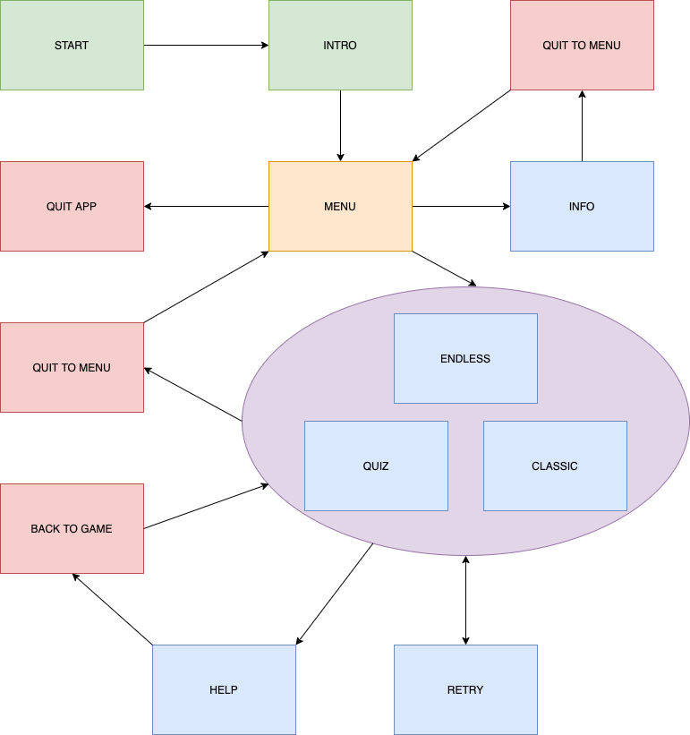

Please view in RAW form

T1A2-1 STATEMENT OF PURPOSE AND SCOPE

The purpose of this terminal app is to practice and improve the invoking of spells for a character named Carl, the Invoker, from DOTA 2. This character is one of the most complex in the game to play and master, as his 10 spells need to be invoked from a combination of 3 reagents - Quas, Wex and Exort, or Q, W, E for short. Once a combination of Q, W, and/or E is applied, we Invoke the reagents with R.
This terminal app will help players and users improve on muscle memory to invoke his spells, practice how fast spells will be invoked, help memorise all spells and combinations, or simply just as a fun minigame and to keep sharp in invoking and casting his spells, whether you play DOTA 2 or not! In battle it is crucial to combine spells and use them quickly to help yourself and your team, and oftentimes players invoke the wrong spells, or simply forget which spells to invoke! With practice on this terminal app, you can help minimize mistakes and maximize speed and efficiency in casting spells with Invoker, all without needing to open up the DOTA 2 game! Wipe out your enemies and leave your allies in awe as you invoke and cast spells like a pro! There are a few Invoker trainer modes, each with their own benefits in learning and keeping sharp with playing the character. Users can choose which game mode they feel is best for them to practice with. I recommend ENDLESS for those that are just starting out or still learning Invoker's spells and combinations, QUIZ and CLASSIC for those that are at an intermediate level that want to be tested and keep up with practice. COMBO and LEGACY mode (coming soon) will be for advanced users to truly test their skills and speed!

T1A2-2 FEATURES

There will be 3 main modes/features from the main menu in this terminal app:

CLASSIC
In CLASSIC mode, the user will be invoking all 10 spells as fast as possible, given in random order. The user will be given one spell at a time to invoke. Once the user has invoked all 10 spells, they will have the option to "retry" CLASSIC mode or "quit" to the main menu and choose another mode to play. If the user invokes the wrong spell or has an invalid input, they will be asked to try again. 

QUIZ
In QUIZ mode, the user will be shown combinations of Q, W and/or E. The user will have to input the name of the spell that would be invoked from the given combination. For example, the user is given the combination of QQQ, which the answer to this would be "cold snap". Once all 10 spells have been answered, the user will have the option to "retry" QUIZ mode or "quit" to the main menu and choose another mode to play. If the user names the wrong spell or has an invalid input, they will be asked to try again. 

ENDLESS
In ENDLESS mode, the user will continuosly be given spells to invoke, one after another. The spells given to invoke will be given one at a time, at random. ENDLESS mode will keep running until the user inputs "quit" to exit to the main menu. If the user invokes the wrong spell or has an invalid input, they will be asked to try again. In ENDLESS mode, users can type "help" to show the list of Invoker's spells to give themself a reminder of the names of the spells, along with the combinations of Q, W, and/or E that invoke the spell.

Additional features like a timer or point system may be added in future.

T1A2-3 USER INTERACTION AND EXPERIENCE

When the user opens the terminal app, they will be greeted with a brief intro with a list of options, which can be selected by giving the valid input provided. The intro will recommend that the user checks out INFO before playing, as it will give information on available game/feature modes and how to play. Invoker's 10 spells and combinations needed to invoke will be shown from the INFO selection. A page link will also be provided in this section if the user wishes to read about Invoker in depth. In each mode/feature, users will be tested on their knowledge and speed of Invoker's spells, in different ways and settings, depending on the mode/feature chosen. If the user enters the wrong or invalid input, they will be asked to try again.

T1A2-4 CONTROL FLOW DIAGRAM

